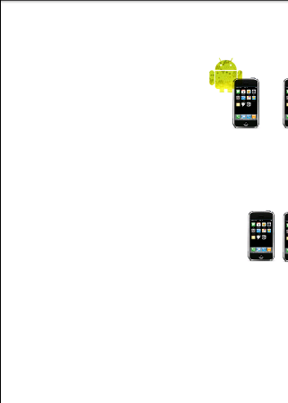

AndParty
========

---

AndParty
========

---

Slide #2
========
AndParty sample code can be found at:
[AndParty sample code](https://github.com/shareme/AndParty)

---

Slide #3
========
AndParty is a splash screen where as the user touches and
drags the android and the iphones will lineup at
the touchpoint to show simple AI in the form of 
finite state machines.

---

Slide #4
========
What is a Finite State Machine(FSM)?

One of the core components of any application is a Finite State Machine that
involves:

-  A Model of behavior

-  States of that Model

-  And Communication between states

---

Slide #5
========
We can use the splash screen as an example to see some techniques...

- Extend ImageView

- Override onDraw

- use invalidate to trigger redraws of object in Handler thus
triggering a recalculation of state.

---

Slide #5
========
Okay, first the model of behavior. In our SplashActivity.java
we have:

---

Slide #6
========
In the AndPartySplash class that extends image view at the 
AndPartySplash constructor:

!java
 Random generator = new Random();
            mHandsetCount = 5 + generator.nextInt(3);
            for (int i = 0; i < mHandsetCount; i++) {
                int[] position = { 50 + generator.nextInt(250),
                        50 + generator.nextInt(350) };
                mHandsetPositions.add(position);
            }

to place the iphones randomly

---

Slide #7
========
Than to place the android randomly:

!java
Random generatorMe = new Random();
            int aXpos = (50 + generatorMe.nextInt(250));
            mAndroidXPos = aXpos;
            int aYpos = (50 + generatorMe.nextInt(125));
            mAndroidYPos = aYpos;
            Message msg = Message.obtain();
            msg.arg1 = MSG_RECALC_HANDSET_POSITIONS;
            handler.sendMessageDelayed(msg, HANDSET_UPDATE_TICKTIME);
            
notice that we are sending a delayed message
which means the redraw is not happening until 200 milliseconds.

---

Slide #8
========
THe other part of the model is obviously the touch events.
