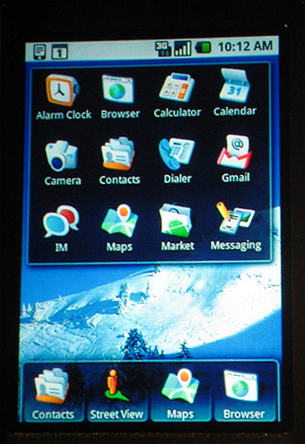
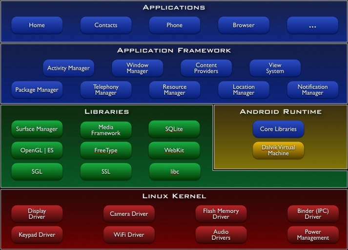
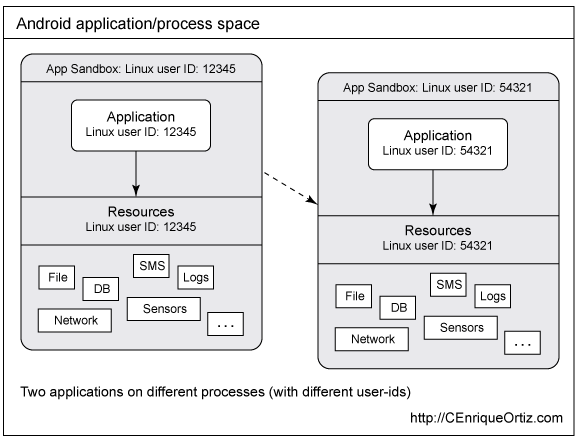
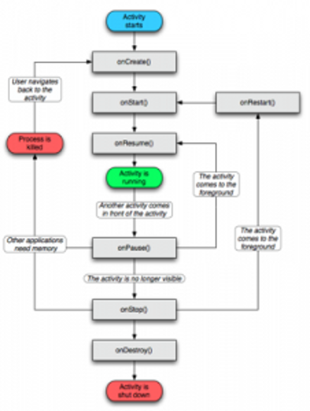

Android Introduction
====================

---

Android Introduction
====================

---

Slide #2 Where did Android come from?
=====================================
Some people from Danger Inc, WebTV, and T-Mobile had this
idea for a new mobile operating system for a new class
of devices called smartphones.

Thus they formed Android Inc and came up with an idea
of a mobile operating system that has an UI that be
declared via XML, that has full web browser, has
a database engine, and would have the java application
be a new VM instance with its own security sandbox
to protect smartphone users.

---

Slide #3 Android Inc
====================

In 2005 Android Inc was bought by Google to bring about 
a more open Mobile Operating System to OEMS which in turn
would provide more features to device users.

Open Handset Alliance was formed by Google In November
of 2007 to oversee Android OS development with the first
Android SDK release in November of 2007.

---

Slide #4 What is a Smartphone?
==============================

Smartphones are those devices with these features:

-Full web browser, usually html5 compliant
-an embedded database engine
-usually has a touch screen interface

---

Slide #5 The Android OS Stack
=============================

The android OS stack is composed of:

- a modified linux kernel with mobile device drivers
- an android runtime in form of java libs and the Dalvik VM
- a media framework for audio
- an openGL 2d/3d framework
- SGL-2d graphics engine
- libc-System C Library
- webkit
- SQLite
- applications frameworks

---

Slide #6 The Android OS Stack
=============================

---

Slide #7 What is Java?
======================

Java is a Virtual Machine computer language with the core libraries
and the Virtual Machine handling such things as memory 
management. The syntax comes form both C and C++ but with a
much simpler object model and has fewer lower-level
facilities.

Java was originally designed for a remote TV device running
a sparc CPU. However, at this point its found in servers, 
browsers as applets and desktops, and mobile devices.

---

Slide #8 Android Java
=====================

Android Java while a subset of JavaSE through use of 
some of Apache Harmony apis includes more apis
for more features than JavaME does. Android applications
have a different application life-cycle from javaMe
in that an activity is the modular unit of an application
and there is no exit as the OS handles when to 
clean-up and garbage collect an activity.

Android is unique in that the UI on the device is
programmable via both java code and XML. And unlike JavaME
Android Java Applications do not run on-top-of Android
but at the native level. For example the HomeScreen
application that shows the screen icons, etc is fact
an android java application.

---

Slide #9 Each Activity its own process
======================================

Android Java has some other uniqueness to the platform.
Each activity within the same application gets the
same user space while applications get different user IDs.
See next slide..

---

Slide #10
==========

Credit: [CEO's IBM article](http://www.ibm.com/developerworks/opensource/library/x-androidsecurity/index.html?ca=drs-)

---

Slide #11
==========
And the Android Application Life-cycle is different from
other java platforms in that the modular unit is an activity,
see slide 12.

---

Slide #12
=========
