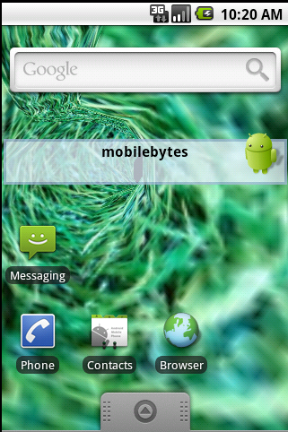

Android Live Wallpapers
=======================

---

Android Live Wallpapers
=======================
Android 2.1 introduced the concept of Live Wallpapers

- Android 2.1 or higher

- Requires

    !xml
    <uses-sdk android:minSdkVersion="7" />

- Requires

    !xml
    <uses-feature
    android:name="android.software.live_wallpaper" />

- Requires
    !xml
    <meta-data android:name="android.service.wallpaper"
                android:resource="@xml/livewallpaper" />

---

Slide #2
========

Sample code can be found at:
[DrWhoLiveWallpaper](https://github.com/shareme/DrWhoLiveWallpaper)

---

Slide #3
==========
All the rage is to do an animated OpenGL LW

- requires proper opengl setup

- requires proper opengl threading

---

Slide #4
========

Richard Green() determined that GLSurfaceview had 99% of the
code required and modified that and made a code submission and
a blog post:

[GLWallpaperService blog post](http://www.rbgrn.net/content/354-glsurfaceview-adapted-3d-live-wallpapers)

---

Slide #5
========
Thus with that code all we need is a engine(WallPaperService term) and
the opengl renderer we wil be using.

But, lets begin with the AndroidManinfest setup first.

---

Slide #6
========

The AndroidManifest setup for LiveWallpapers

    !xml
    <?xml version="1.0" encoding="utf-8"?>
      <manifest xmlns:android="http://schemas.android.com/apk/res/android"
      package="com.mobilebytes.drwholivewallpaper"
      android:versionCode="1"
      android:versionName="1.0">
    <application android:icon="@drawable/drwholivewpicon"
       android:label="@string/app_name">
      <service
      android:label="DrWhoLive Wallpaper"
      android:name=".DrWhoLiveWallpaperService"
      android:permission="android.permission.BIND_WALLPAPER">
      <intent-filter>
        <action
          android:name="android.service.wallpaper.WallpaperService" />
      </intent-filter>
      <meta-data android:name="android.service.wallpaper"
                android:resource="@xml/livewallpaper" />
    </service>

    </application>
    <uses-sdk android:minSdkVersion="7" />
     <uses-feature
    android:name="android.software.live_wallpaper" />

</manifest>

---

Slide #7
========
The LiveWallpaper layout lives in a res/xml folder
    !xml
    <?xml version="1.0" encoding="UTF-8"?>
    <wallpaper
      xmlns:android="http://schemas.android.com/apk/res/android"
      android:thumbnail="@drawable/icon"
      android:description="@string/app_name"/>

---

Slide #8
========
Now we need something opengl, a 3dTunnel

- starting point

- calculate number of vertices

- allocate arrays

- generate object data which fills the arrays

- clear buffers and transfer array data to buffers

- nextFrame and render methods than use the buffer data

---

Slide #9
========
    !java
    public Tunnel3D(int revolution, int depth) {
        start_a = 0;
        start_v = 0;

        // Calculate number of vertices...
        nx = revolution;
        ny = depth;
        nv = nx * ny;

        // Allocate arrays...
        colors = new byte[nv * 3];
        vertices = new float[nv * 3];
        faces = new short[((nx + 1) * (ny - 1)) << 1];
        texture = new float[nv * 2];

        // Generate object data...
        genVertex();
        genFaces();
        genColors();
        genTexture();

        // Build direct buffer objects...
        buildBuffers();

        // Blit data...
        fillVertex();
        fillFaces();
        fillColors();
        fillTexture();
    }

---

Slide #10
========
Now

- a Renderer Class that implements GLSurfaceView.Renderer,
        GLWallpaperService.Renderer

- A MainActivity

---

Slide #11
=========

    !java
    public class MainActivity  extends Activity {
    /** The gl view. */
    private GLSurfaceView glView;
    @Override
    public void onCreate(Bundle savedInstanceState) {
        super.onCreate(savedInstanceState);
        glView = new GLSurfaceView(this);
        glView.setDebugFlags(GLSurfaceView.DEBUG_CHECK_GL_ERROR);
        glView.setRenderer(new DrWhoLiveRenderer(getBaseContext()));
        setContentView(glView);
    }
    @Override
    protected void onDestroy() {
        super.onDestroy();
    }
    @Override
    protected void onPause() {
        glView.onPause();
        super.onPause();
    }
    @Override
    protected void onResume() {
        super.onResume();
        glView.onResume();
    }
}

---

Slide #12
=========

---

Slide #13
=========

Video can be found here:
[DrWhoLiveWallpaperVideo](http://www.youtube.com/watch?v=4oGKcIuYiQE)

