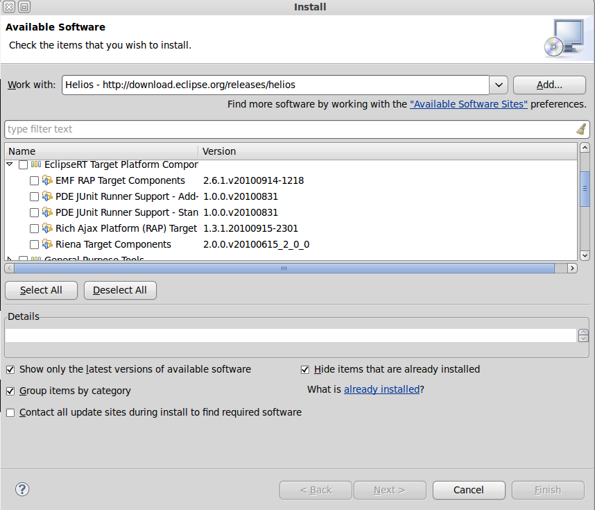

Eclipse Install
===============

---

Eclipse Install
===============

At this time Google only supplies an Eclipse Android Development
Tool plugin. Those new to Eclipse usually run into
install problems so let me detail the install sequence.

---

Slide 1# Eclipse Distro
=======================

What Eclipse Distribution to install? Google ADT plugin 
requires the WTP project thus its best to install the
Eclipse Model distribution. However, there are some
packages you leave off to get a correctly functioning
installation.

[EclipseDownloads](http://www.eclipse.org/downloads/)

---

Slide 2# Eclipse Packages not to install
========================================

Eclipse packages not to install:
- EclipseRT: Riena Target Components, EMF RAP Target Components, 
  Rich Ajax platform Target(RAP), PDE JUNit Addon, PDE Junit standalone

In the following slide it looks like..

---

Slide 3#
========

---

Slide 4#
========  
Every else under the release name install and of  course install
The Eclipse Platform Updates as well.
